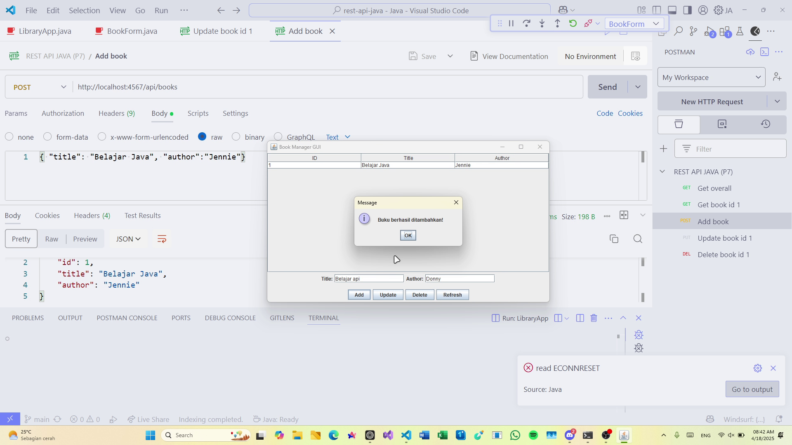

# Simple REST API Development dalam Java
> Dikerjakan oleh Donny Andrian / 23100002

## DEMO
[link video](https://drive.google.com/file/d/1Q6cgBKCiKPp4NDPZzoOFnA7zL-ozOING/view?usp=sharing)

## Contoh tampilan refresh/reload data
- Tampilan sebelum ada data apapun (initial)

- Tampilan setelah ada data (refreshed)

## Contoh tampilan menambah data
- Tampilan proses penginputan data pada fields

- Tampilan saat item berhasil ditambahkan

- Tampilan daftar item setelah item baru ditambahkan

## Contoh tampilan mengubah data
- Tampilan proses pemilihan item dan penginputan data baru pada fields

- Tampilan saat item berhasil diubah

- Tampilan daftar item setelah item diubah

## Contoh tampilan menghapus data
- Tampilan proses pemilihan item yang ingin dihapus

- Tampilan saat item berhasil dihapus

- Tampilan daftar item setelah item dihapus

## POSTMAN Collection
POSTMAN Collection yang digunakan untuk menguji REST API pada project ini dapat ditemukan pada [file](./REST%20API%20JAVA%20(P7).postman_collection.json) ini (`REST API JAVA (P7).postman_collection.json`).